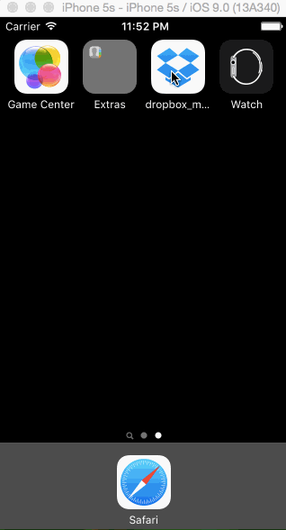

# Dropbox Demo

This is an iOS mock-up for the basic features of Dropbox. 

Time spent: 10 hours.

Completed user stories: 


Required: 

  - User can tap through the 3 welcome screens

  - User can follow the create-user flow

      - On the created user form, the user can tap the back button to go to the page where they can sign in or create an account

      - Before creating the account, user can choose to read the terms of service

      - After creating the account, user can view the placeholder of Files, Photos, and Favorites as well as the Setting screen

      - User can log out from the Settings screen

  - User can follow the sign-in flow

      - User can tap the area for "Having trouble signing in?"

      - User can log out from the Settings screen


Optional: 

  - User can swipe through the welcome screens



Walk-through of the user stories:


